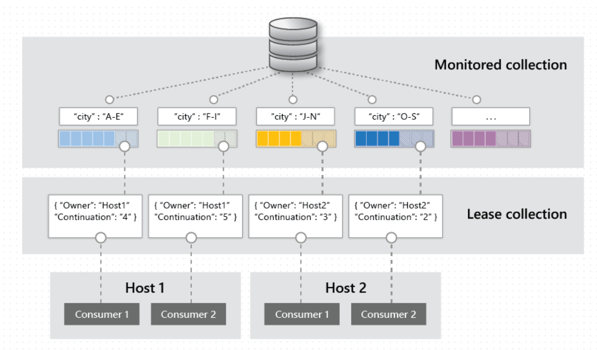

# Cosmos DB Change Feed and Distributed Cache

This repo contains 3 demos : 

- Cosmos DB Change Feed ( processor + materialized view ) 
- Cosmos DB data writer ( enable multi-master and confliction policy )
- Cosmos DB + Distributed cache 

## References

- Cosmic Notes :  https://docs.microsoft.com/en-gb/samples/browse/
- Cosmos DB Labs and workshops online :  https://cosmosdb.github.io/labs/

## More details on my blog : 

Please go to my blog cloud-melon.com to get more details about how to implement this solution and more about Microsoft Azure ( ref link : https://cloud-melon.com )

Feel free to reach out to my twitter **@MelonyQ** for more details ( https://twitter.com/MelonyQ ). 

